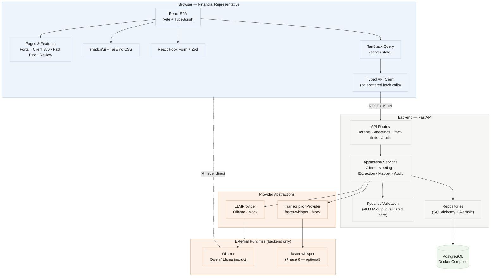
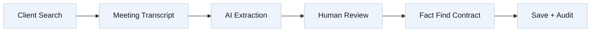
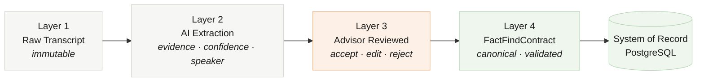
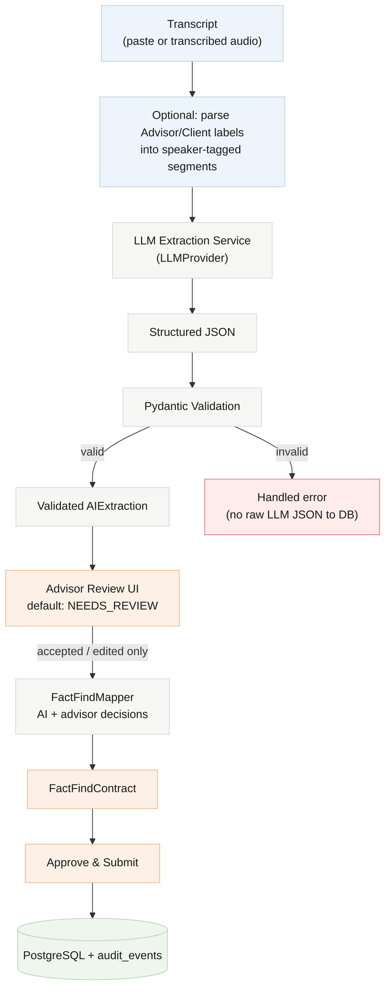
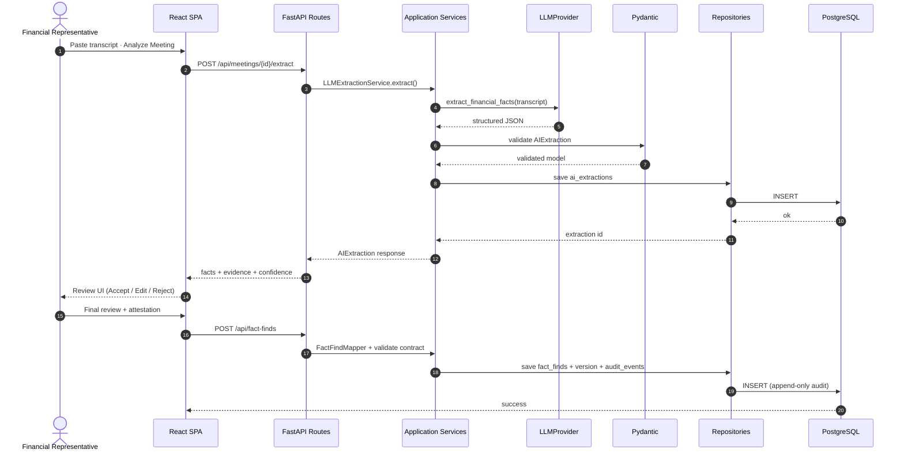
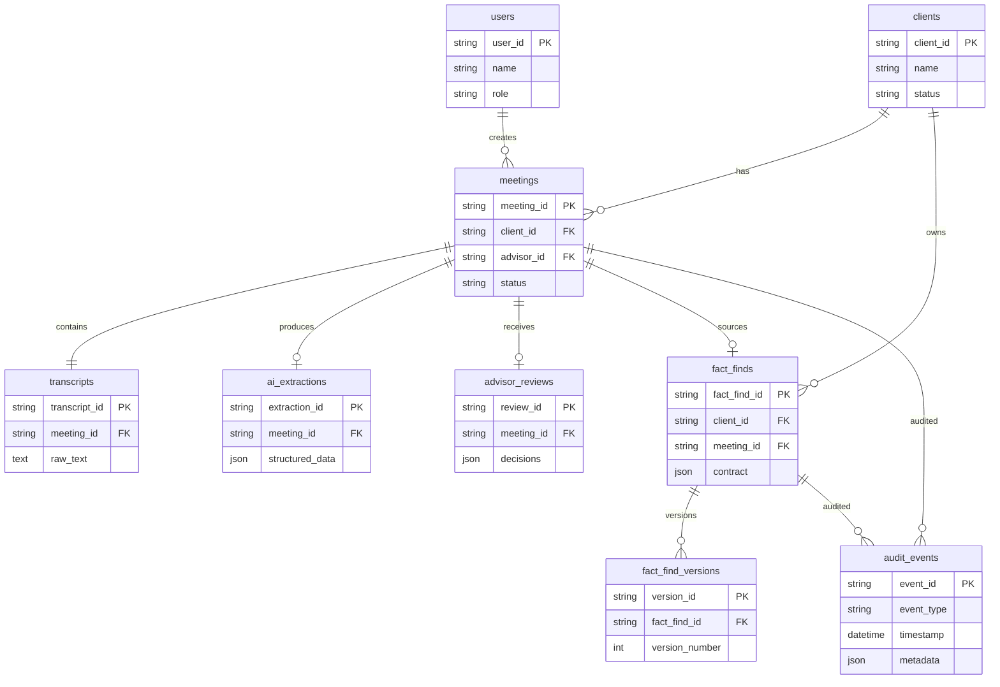
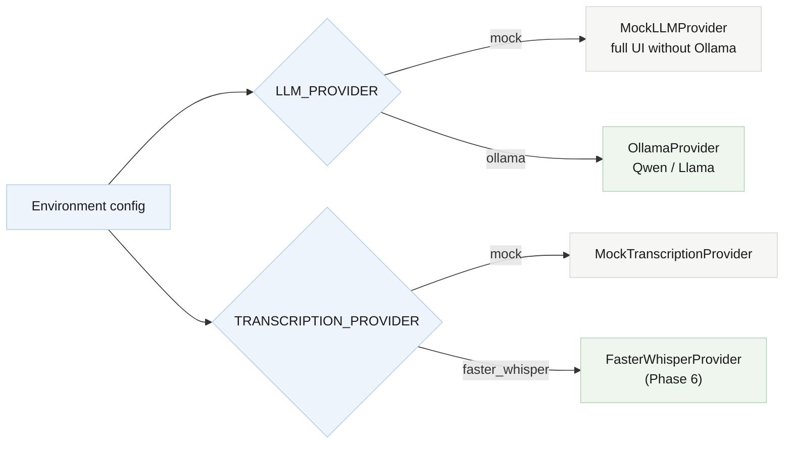

# Advisor AI Fact Finder — Architecture Diagrams

Mermaid views of the MVP architecture described in `ARCHITECTURE.md`.

---

## 1. System overview (layers + trust boundary)

**Key rule:** React always calls FastAPI. The browser never talks to Ollama or faster-whisper directly.

---

## 2. Core workflow (vertical slice)

---

## 3. Four data layers (immutable pipeline)

Each layer is preserved. **No layer overwrites another.**

When an advisor edits a value, both `originalAIValue` and `advisorValue` are kept for auditability.

---

## 4. AI extraction pipeline (trust gates)

---

## 5. Backend request flow (Routes → Services → Repositories)

---

## 6. Persistence model (main tables)

---

## 7. Development modes (provider switching)

Build against **mock providers first** (Phases 1–5). Wire Ollama in Phase 3 and faster-whisper in Phase 6 without blocking the transcript-based workflow.
